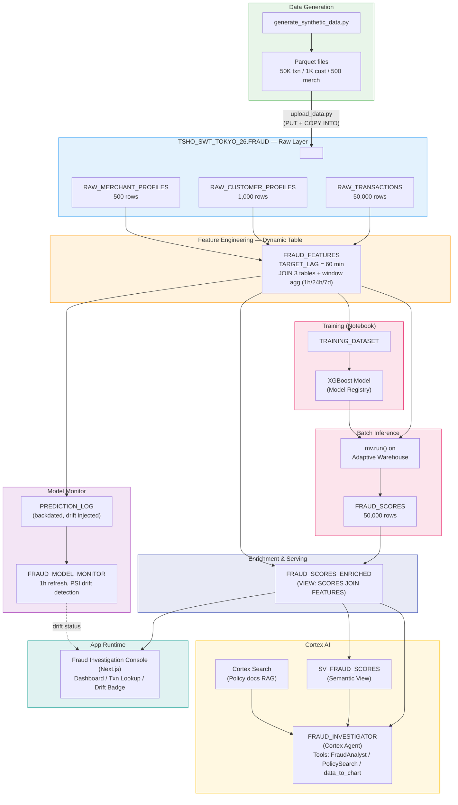

# Demo 2: AI-Powered Fraud Detection Pipeline

CoCo (Cortex Code) を使い、不正検知パイプラインの構築・運用・調査を10分で実演するデモです。

## Architecture



## Snowflake Features

| 機能 | 用途 |
|------|------|
| **Adaptive Warehouse** | `FRAUD_DEMO_ADAPTIVE_WH` — サイズ指定不要、推論・クエリ用 |
| **Dynamic Table** | `FRAUD_FEATURES` — 60分ラグで特徴量を自動更新 |
| **Model Registry** | XGBoost モデルの登録・バージョン管理 |
| **Batch Inference** | `mv.run()` で50,000件を一括スコアリング（WH 実行） |
| **Model Monitor** | `FRAUD_MODEL_MONITOR` — 1時間更新、PSI でドリフト検知 |
| **Semantic View** | `SV_FRAUD_SCORES` — Cortex Analyst 用の構造化メタデータ |
| **Cortex Agent** | `FRAUD_INVESTIGATOR` — text-to-SQL + RAG + チャート生成 |
| **Cortex Search** | `FRAUD_POLICY_SEARCH` — 不正ポリシー文書の全文検索 |
| **App Runtime** | Next.js アプリを `snow app deploy` でデプロイ |

## Directory Structure

```
demo2/
├── setup/                          # Snowflake オブジェクト作成 SQL
│   ├── 00_account_prerequisites.sql  # Role, WH, DB, Schema
│   ├── 01_create_tables.sql          # Raw テーブル + Stage
│   ├── 02_create_transformation_layer.sql  # Dynamic Table + Views
│   ├── 03_create_feature_store.sql   # Feature Store Entity + Feature View
│   ├── 04_create_model_objects.sql   # Training dataset + scoring objects
│   ├── 05_create_agent_objects.sql   # Search, Semantic View, Agent
│   ├── 06_create_model_monitor.sql   # Model Monitor
│   └── 99_cleanup.sql                # 全オブジェクト削除
├── data/
│   └── synthetic/                  # 合成 Parquet データ
├── scripts/
│   ├── generate_synthetic_data.py  # データ生成（ドリフト注入含む）
│   └── upload_data.py              # Snowflake へアップロード
├── notebooks/
│   └── 02_train_fraud_model.ipynb  # XGBoost 学習 + Registry 登録
├── agent/
│   ├── semantic_model.yaml         # Semantic View 定義
│   ├── fraud_policy.md             # 不正対応ポリシー
│   ├── investigation_playbook.md   # 調査プレイブック
│   └── evaluation_questions.csv    # Agent 評価用質問集
├── app/                            # App Runtime (Next.js)
│   ├── snowflake.yml               # Snowflake App 定義
│   ├── app.yml                     # ビルド・実行設定
│   └── ...
└── demo/
    ├── runbook.md                  # 9分30秒タイムライン
    └── expected_outputs.md         # バックアップ用期待出力
```

## Prerequisites

- Snowflake アカウント（ACCOUNTADMIN 権限で初回セットアップ）
- `TSHO_SWT_TOKYO_26` データベースが作成済み
- Python 3.11+ / `uv` / Snowflake CLI (`snow`)
- App Runtime が利用可能なリージョン

## Setup

```bash
# 1. Snowflake オブジェクト作成 + データ生成・アップロード (00〜04 + synthetic data)
SNOWFLAKE_CONNECTION_NAME=<connection_name> bash demo2/reset_demo2.sh

# 2. モデル学習 (Notebook)
# demo2/notebooks/02_train_fraud_model.ipynb を実行
#   - XGBoost 学習 + Model Registry 登録
#   - mv.run() で FRAUD_SCORES を生成

# 3. Agent + Monitor オブジェクト作成 (Notebook 完了後)
snow sql -c sfdevrel_pat -f demo2/setup/05_create_agent_objects.sql
snow sql -c sfdevrel_pat -f demo2/setup/06_create_model_monitor.sql

# 4. アプリデプロイ
cd demo2/app && snow app deploy --connection sfdevrel_pat
```

## Cleanup

```sql
-- demo2/setup/99_cleanup.sql を実行
```
